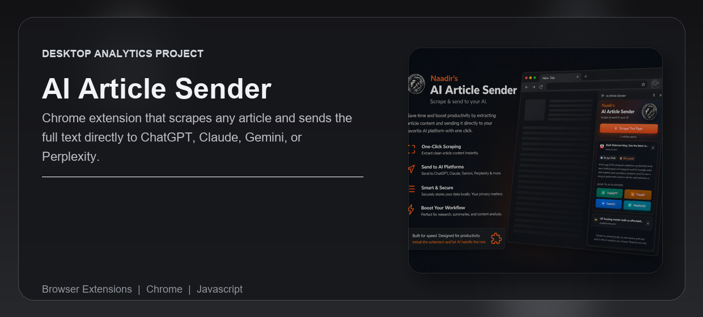

---
<div align="center">


<br /><br />

<p><strong>Chrome extension that scrapes any article and sends the full text directly to ChatGPT, Claude, Gemini, or Perplexity.</strong></p>

<p>Built for people who read, research, or analyze content and need a fast way to move articles into AI tools without copy-paste friction.</p>

<p>
  <a href="#overview">Overview</a> |
  <a href="#what-problem-it-solves">What It Solves</a> |
  <a href="#feature-highlights">Features</a> |
  <a href="#screenshots">Screenshots</a> |
  <a href="#quick-start">Quick Start</a> |
  <a href="#tech-stack">Tech Stack</a>
</p>

<h3><strong>Made by Naadir | April 2026</strong></h3>

</div>

---

## Overview

AI Article Sender is a Chrome extension that extracts clean article content from any webpage and sends it directly to AI platforms in one action. It removes ads, clutter, and irrelevant markup, leaving only structured text ready for analysis, summarisation, or transformation.

The workflow is simple: open any article, click "Scrape This Page", and choose your target AI platform. The extension captures the content, formats it, and transfers it into ChatGPT, Claude, Gemini, or Perplexity without manual copying or tab switching.

The result is a faster research pipeline. Instead of breaking focus to clean and paste content, users move directly from reading to thinking. It turns passive browsing into an active, AI-assisted workflow.

## What Problem It Solves

- Manual copy-paste of long articles into AI tools is slow and inconsistent
- Extracting clean content from cluttered pages requires effort and breaks focus
- Switching between tabs and platforms disrupts research flow
- Default workflows don’t preserve structure or context when moving content into AI

### At a glance

| Track | Analyse | Compare |
|---|---|---|
| Articles and page content | Clean extracted text | Raw webpage vs cleaned output |
| Current page state | Word count and structured content | Manual copy vs one-click transfer |
| Saved articles locally | Ready-to-send formatted input | Multi-platform AI outputs |

## Feature Highlights

- **One-click scraping**, extracts clean article content instantly without ads or noise
- **Multi-platform sending**, pushes content directly to ChatGPT, Claude, Gemini, or Perplexity
- **Local storage**, saves scraped articles on-device with no external tracking
- **Structured output**, preserves readable formatting for better AI responses
- **Fast workflow**, eliminates tab switching and manual copy-paste
- **Minimal UI**, focused sidebar interface that stays out of the way

### Core capabilities

| Area | What it gives you |
|---|---|
| **Content extraction** | Clean, readable article text from any webpage |
| **AI integration** | Direct transfer into multiple AI platforms |
| **Local persistence** | Saved articles stored securely on the device |
| **Workflow speed** | Reduced friction from reading to analysis |

## Screenshots

<details>
<summary><strong>Open screenshot gallery</strong></summary>

<br />

<div align="center">
  
  <br /><br />
  
  <br /><br />
  
</div>

</details>

## Quick Start

```bash
# Clone the repo
git clone https://github.com/Naadir-Dev-Portfolio/AI-Article-Sender.git
cd AI-Article-Sender

# Install dependencies
npm install

# Run
Load the extension via chrome://extensions (Developer Mode → Load unpacked)
```

No API keys required. The extension works entirely in-browser and uses direct platform links for sending content.

## Tech Stack

<details>
<summary><strong>Open tech stack</strong></summary>

<br />

| Category | Tools |
|---|---|
| **Primary stack** | `JavaScript` | `HTML` | `CSS` |
| **UI / App layer** | Chrome Extension APIs (popup + sidebar UI) |
| **Data / Storage** | Chrome local storage |
| **Automation / Integration** | Direct linking to ChatGPT, Claude, Gemini, Perplexity |
| **Platform** | Web (Chrome browser) |

</details>

## Architecture & Data

<details>
<summary><strong>Open architecture and data details</strong></summary>

<br />

### Application model

User opens a webpage → clicks extension → content script extracts article text → text is cleaned and structured → stored locally → user selects AI platform → content is injected or transferred into the selected platform.

### Project structure

```text
AI-Article-Sender/
+-- src/
+-- content/
+-- manifest.json
+-- README.md
+-- repo-card.png
+-- screens/
|   +-- screen1.png
+-- portfolio/
    +-- ai-article-sender.json
    +-- ai-article-sender.webp
```

### Data / system notes

- All data is stored locally using Chrome storage APIs
- No external backend or tracking involved
- Content is processed client-side before sending to AI platforms

</details>

## Contact

Questions, feedback, or collaboration: `naadir.dev.mail@gmail.com`

<sub>JavaScript | HTML | CSS</sub>

---
